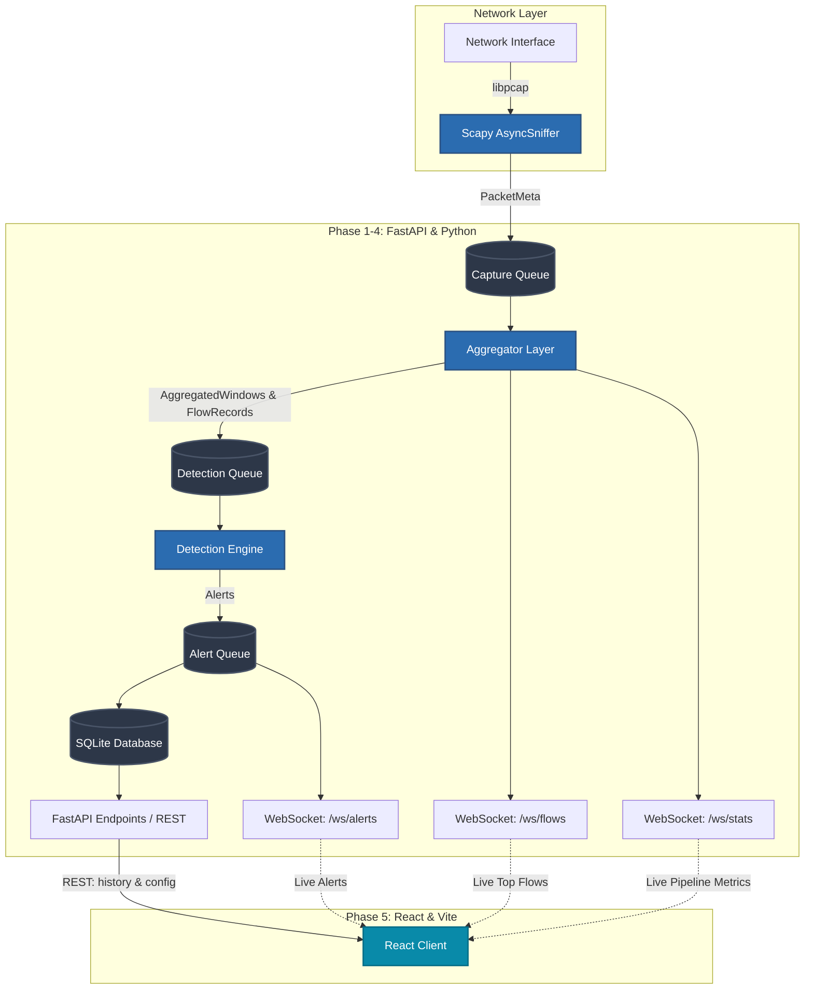

# NetWatch — AI-Assisted Real-Time Network Traffic Analyzer

A layered, professional-grade network Intrusion Detection System (IDS) equipped with a live React dashboard, SQLite persistence, and rule-based threat detection. Built with Python 3.13, Scapy, FastAPI, asyncio, React, and Vite.

**Current Status:** Phases 1–5 Complete (Live Capture → Aggregation → Rule Detection → API/Storage → React Dashboard).

---

## 🏗️ Architecture

NetWatch operates as a decoupled data pipeline, moving live packets through stages using asynchronous, thread-safe queues.



---

## ✨ Features

- **High-Performance Capture**: Uses `Scapy` with `store=False` and raw Berkeley Packet Filters (BPF) to ensure low RAM accumulation during high-volume bursts.
- **Stateful Aggregation**: Tracks flow states and bins packets into rolling 1s, 10s, and 60s windows for time-series analysis.
- **Rule-Based Engine**: Detects 5 common attack vectors dynamically:
  1. Port Scans (Horizontal & Vertical)
  2. SYN Floods
  3. Brute Force Attempts
  4. DNS Tunneling
  5. C2 Beaconing
- **Real-Time Dashboard**: A custom dark-themed React dashboard displaying pipeline metrics, stacked traffic charts, and a virtualized live alert feed.
- **Resilient Connectivity**: Custom frontend WebSocket hooks handle auto-reconnection and graceful degradation.

---

## 🚀 Quick Start

### 1. Backend Setup

The backend captures live traffic and serves the API.

```bash
cd netwatch/backend

# Install dependencies
python -m venv .venv
source .venv/bin/activate
pip install -e ".[dev]"

# Run the backend (requires root for packet capture on most interfaces)
# Note: For safe local testing without privileges, use the loopback interface
sudo .venv/bin/python -m netwatch.backend.main --iface lo
```

*The backend runs on `http://0.0.0.0:8000`. It automatically initializes the SQLite database at `data/alerts.db`.*

### 2. Frontend Setup

The frontend consumes the backend's REST APIs and WebSockets.

```bash
cd frontend

# Install dependencies
npm install

# Run the development server
npm run dev
```

*The dashboard runs on `http://localhost:3000`. The Vite proxy is pre-configured to point to the backend at `:8000`.*

---

## 🧪 Testing

The backend boasts a highly robust test suite with **85% code coverage** (237 passing tests), verifying parsing logic, ring-buffer overflows, persistence schemas, detection heuristics, and WebSocket broadcasting.

```bash
cd netwatch/backend
pytest tests/ -v --cov=netwatch/backend --cov-report=term-missing
```

---

## 🗺️ Phase Roadmap

| Phase | Status | Description |
|-------|--------|-------------|
| **1 — Capture & Parse** | ✅ Done | BPF, Scapy AsyncSniffer, PacketMeta dataclasses |
| **2 — Aggregation** | ✅ Done | FlowTracker, TimeWindowBucket, SessionTracker |
| **3 — Detection Engine** | ✅ Done | Port scan & SYN flood rules |
| **4 — Storage & API** | ✅ Done | SQLite, FastAPI, WS Broadcasters, 3 additional rules |
| **5 — React Dashboard** | ✅ Done | Vite, Zustand, Recharts, Virtualization, UI Polish |
| 6 — LLM Integration | ⏳ Next | Local Ollama/Phi-3 integration for alert enrichment |
| 7 — Network Graph | ⬜ Planned | D3.js visualization of attacking nodes |

---

## 🔒 Security Notes

- **Capture Privileges**: Running the backend on live interfaces (e.g., `eth0`, `wlan0`) requires `CAP_NET_RAW`. Using `sudo` is the easiest method locally, or `setcap cap_net_raw,cap_net_admin=eip $(readlink -f $(which python3))` to avoid running all of Python as root.
- **Data Retention**: Raw packet payloads are intentionally **never stored**. The system only retains parsed `PacketMeta` fields and aggregated metadata to ensure privacy.
