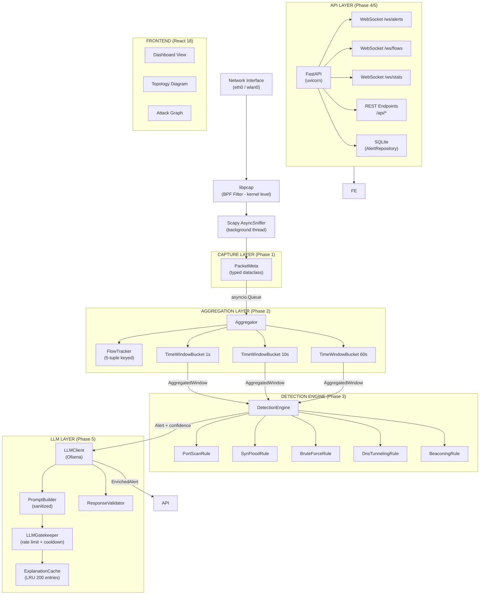
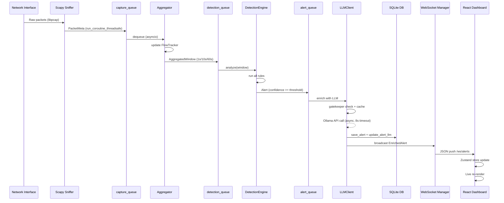
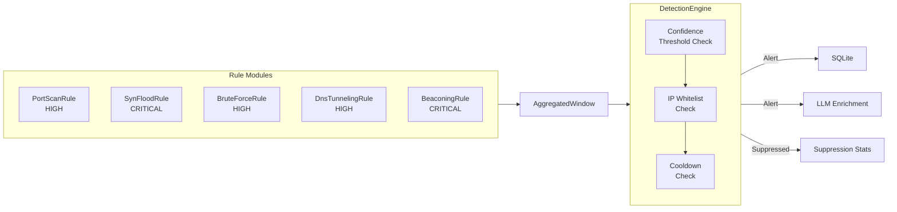
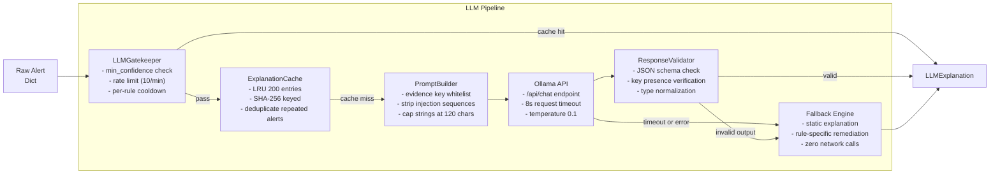
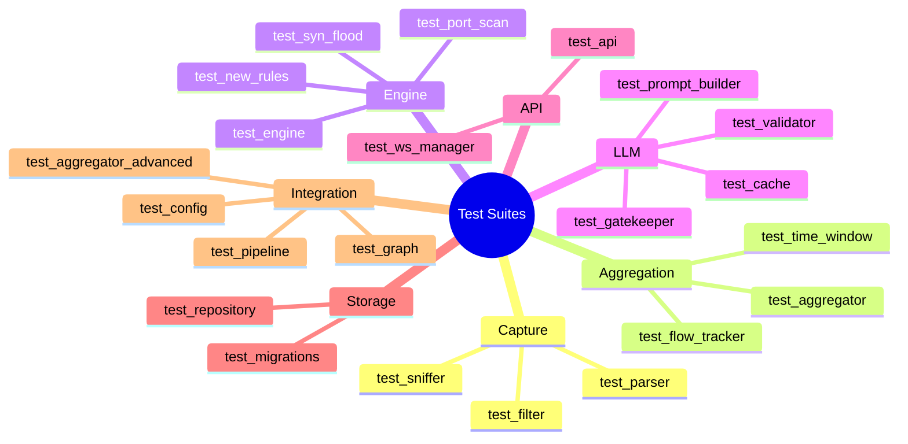
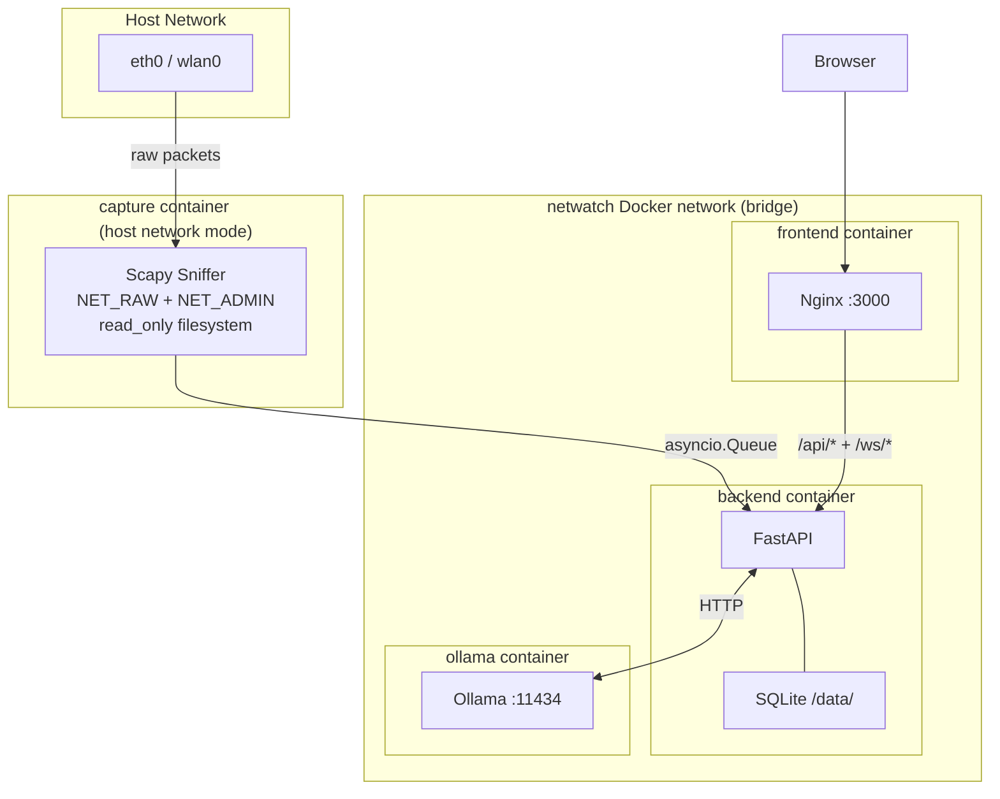
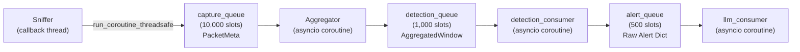
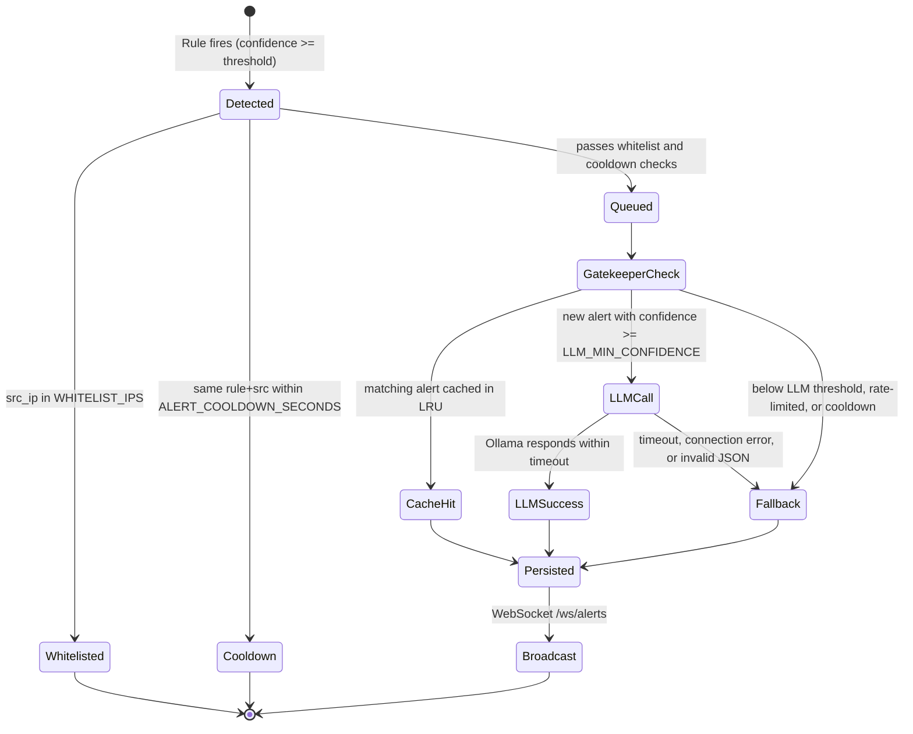
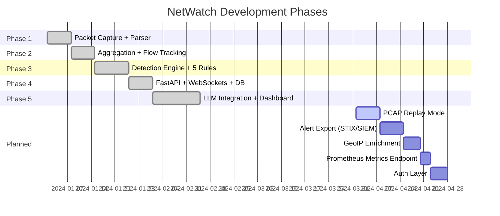

# NetWatch: Local Network Traffic Analyzer and Intrusion Detection

<div align="center">


Local network intrusion detection system with on-device LLM threat explanation.

[Features](#features) · [Architecture](#architecture) · [Installation](#installation) · [Detection Rules](#detection-rules) · [API Reference](#api-reference) · [Contributing](#contributing)

</div>

---

## Author

**Prithvi** ([@prithvi-01x](https://github.com/prithvi-01x))

---

## Overview

NetWatch inspects live network traffic, flags suspicious behavior with rule-based detection, and generates local explanations for each alert using Ollama. It pairs an asynchronous Python backend (FastAPI, Scapy, SQLite) with a React dashboard to display live flows, topology maps, and alert timelines without sending packet data to external services.

- Packet capture runs locally via Scapy and libpcap with kernel-level BPF filters.
- A sliding multi-window aggregator tracks per-flow metrics across 1s, 10s, and 60s windows.
- Pluggable heuristic rules detect port scans, SYN floods, brute-force attempts, DNS tunneling, and C2 beaconing.
- Ollama generates plain-text threat summaries and analyst remediation guidance directly on your machine.
- All telemetry and alerts remain stored on the local filesystem.

---

## Features

| Category | Capability |
|----------|-----------|
| **Capture** | Live packet capture via Scapy + libpcap with BPF kernel filtering |
| **Aggregation** | Multi-bucket time windows (1s, 10s, 60s) with 5-tuple flow state tracking |
| **Detection** | 5 modular detection rules with confidence scoring and rate limiting |
| **LLM** | Local Ollama inference (phi3, mistral, llama3) with deterministic fallbacks |
| **API** | FastAPI REST endpoints plus 3 dedicated WebSocket streaming channels |
| **Frontend** | React 18 dashboard with virtualized alert lists, network topology, and attack graphs |
| **Storage** | SQLite database with automated migration runner and snapshot retention pruning |
| **Docker** | Multi-container Compose configuration with least-privilege capture runtime |
| **Testing** | 22 pytest suites covering sniffer, aggregator, rules, API, and storage |

---

## Architecture

NetWatch organizes packet processing into five decoupled stages connected by bounded `asyncio.Queue` instances:

1. **Capture**: Raw packets are read from network interfaces via libpcap, parsed to typed `PacketMeta` records, and enqueued.
2. **Aggregation**: The aggregator tracks 5-tuple flows and rolls up metrics into sliding 1s, 10s, and 60s windows.
3. **Detection**: Rules evaluate sealed windows and generate alerts with confidence scores and evidence payloads.
4. **LLM Enrichment**: Candidate alerts are enriched with local Ollama explanations and analyst guidance.
5. **API and Delivery**: FastAPI serves REST endpoints and broadcasts real-time alerts and flow statistics over WebSockets to the React dashboard.

### System Architecture Diagram


```mermaid
flowchart TB
    NI["Network Interface\n(eth0 / wlan0)"] --> LP
    LP["libpcap\n(BPF Filter - kernel level)"] --> SC
    SC["Scapy AsyncSniffer\n(background thread)"] --> PM

    subgraph CAPTURE["CAPTURE LAYER (Phase 1)"]
        PM["PacketMeta\n(typed dataclass)"]
    end

    PM -->|asyncio.Queue| AGG

    subgraph AGGREGATION["AGGREGATION LAYER (Phase 2)"]
        AGG["Aggregator"]
        FT["FlowTracker\n(5-tuple keyed)"]
        TW1["TimeWindowBucket 1s"]
        TW2["TimeWindowBucket 10s"]
        TW3["TimeWindowBucket 60s"]
        AGG --> FT
        AGG --> TW1
        AGG --> TW2
        AGG --> TW3
    end

    TW1 & TW2 & TW3 -->|AggregatedWindow| ENG

    subgraph DETECTION["DETECTION ENGINE (Phase 3)"]
        ENG["DetectionEngine"]
        PS["PortScanRule"]
        SF["SynFloodRule"]
        BF["BruteForceRule"]
        DT["DnsTunnelingRule"]
        BC["BeaconingRule"]
        ENG --> PS & SF & BF & DT & BC
    end

    ENG -->|Alert + confidence| LLM

    subgraph LLM_LAYER["LLM LAYER (Phase 5)"]
        LLM["LLMClient\n(Ollama)"]
        PB["PromptBuilder\n(sanitized)"]
        CA["ExplanationCache\n(LRU 200 entries)"]
        GK["LLMGatekeeper\n(rate limit + cooldown)"]
        VA["ResponseValidator"]
        LLM --> PB --> GK --> CA
        LLM --> VA
    end

    LLM -->|EnrichedAlert| API

    subgraph API_LAYER["API LAYER (Phase 4/5)"]
        FAPI["FastAPI\n(uvicorn)"]
        WS1["WebSocket /ws/alerts"]
        WS2["WebSocket /ws/flows"]
        WS3["WebSocket /ws/stats"]
        REST["REST Endpoints\n/api/*"]
        DB["SQLite\n(AlertRepository)"]
        FAPI --> WS1 & WS2 & WS3 & REST & DB
    end

    API_LAYER --> FE

    subgraph FRONTEND["FRONTEND (React 18)"]
        DASH["Dashboard View"]
        TOPO["Topology Diagram"]
        GRAPH["Attack Graph"]
    end
```

---

### Component Interaction & Data Flow


```mermaid
sequenceDiagram
    participant NIC as Network Interface
    participant SC as Scapy Sniffer
    participant AQ as capture_queue
    participant AG as Aggregator
    participant DQ as detection_queue
    participant DE as DetectionEngine
    participant ALQ as alert_queue
    participant LC as LLMClient
    participant DB as SQLite DB
    participant WS as WebSocket Manager
    participant UI as React Dashboard

    NIC->>SC: Raw packets (libpcap)
    SC->>AQ: PacketMeta (run_coroutine_threadsafe)
    AQ->>AG: dequeue (asyncio)
    AG->>AG: update FlowTracker
    AG->>DQ: AggregatedWindow (1s/10s/60s)
    DQ->>DE: analyze(window)
    DE->>DE: run all rules
    DE->>ALQ: Alert (confidence >= threshold)
    ALQ->>LC: enrich with LLM
    LC->>LC: gatekeeper check + cache
    LC-->>LC: Ollama API call (async, 8s timeout)
    LC->>DB: save_alert + update_alert_llm
    LC->>WS: broadcast EnrichedAlert
    WS->>UI: JSON push /ws/alerts
    UI->>UI: Zustand store update
    UI->>UI: Live re-render
```

---

### Directory Structure

```
netwatch/
├── netwatch/
│   └── backend/
│       ├── main.py                  # Entry point, task orchestration
│       ├── config.py                # Pydantic Settings (.env support)
│       ├── models.py                # PacketMeta dataclass
│       ├── pipeline.py              # Shared asyncio.Queues
│       ├── metrics.py               # Prometheus-style counters
│       ├── capture/
│       │   ├── sniffer.py           # PacketCapture (Scapy AsyncSniffer)
│       │   ├── parser.py            # Raw packet -> PacketMeta
│       │   └── filter.py            # BPF filter construction
│       ├── aggregation/
│       │   ├── aggregator.py        # Main aggregation loop
│       │   ├── flow_tracker.py      # 5-tuple flow state tracking
│       │   ├── time_window.py       # 1s/10s/60s bucket logic
│       │   └── models.py            # AggregatedWindow, FlowRecord
│       ├── engine/
│       │   ├── engine.py            # DetectionEngine + rule loader
│       │   ├── models.py            # Alert, RuleResult, Severity
│       │   └── rules/
│       │       ├── base.py          # BaseRule abstract class
│       │       ├── port_scan.py
│       │       ├── syn_flood.py
│       │       ├── brute_force.py
│       │       ├── dns_tunneling.py
│       │       └── beaconing.py
│       ├── llm/
│       │   ├── client.py            # Async Ollama HTTP client
│       │   ├── prompt_builder.py    # Sanitized prompt construction
│       │   ├── cache.py             # LRU explanation cache
│       │   ├── gatekeeper.py        # Rate limiting + cooldowns
│       │   ├── validator.py         # JSON schema validation
│       │   ├── fallbacks.py         # Static fallback explanations
│       │   └── models.py            # LLMExplanation dataclass
│       ├── api/
│       │   ├── main.py              # FastAPI app factory
│       │   ├── ws_manager.py        # Multi-channel WebSocket manager
│       │   ├── serializers.py       # Pydantic response models
│       │   └── routes/
│       │       ├── alerts.py
│       │       ├── stats.py
│       │       ├── config.py
│       │       ├── docker.py
│       │       ├── llm.py
│       │       ├── graph.py
│       │       └── host_ports.py
│       ├── storage/
│       │   ├── database.py          # SQLite wrapper
│       │   ├── repository.py        # AlertRepository CRUD
│       │   └── migrations.py        # Schema versioning
│       └── tests/                   # 22 test suites
├── frontend/
│   ├── Dockerfile.frontend          # Nginx production container
│   ├── src/
│   │   ├── App.tsx                  # Root component (3 views)
│   │   ├── components/
│   │   │   ├── AlertPanel/          # Alert list + cards
│   │   │   ├── StatsBar/            # Live metrics bar
│   │   │   ├── FilterBar/           # Severity/IP/rule filters
│   │   │   ├── TrafficCharts/       # Recharts traffic visualizations
│   │   │   ├── TopologyDiagram/     # ReactFlow network topology
│   │   │   ├── AttackGraph/         # D3 attack graph visualization
│   │   │   └── shared/              # SeverityBadge, LiveIndicator, etc.
│   │   ├── hooks/                   # useAlerts, useStats, useGraph, useFlows
│   │   ├── api/                     # REST client + WebSocket manager
│   │   ├── store/                   # Zustand alert store
│   │   └── types.ts
│   └── package.json
├── docker-compose.yml
├── Dockerfile.backend               # FastAPI backend container
├── Dockerfile.capture               # Scapy sniffer container
├── pyproject.toml
├── requirements.txt
└── .env                             # Runtime configuration
```

---

## Installation

### Prerequisites

| Requirement | Supported Version | Purpose |
|-------------|-------------------|---------|
| Python | 3.12+ | Asynchronous backend (`asyncio.timeout` support) |
| Node.js | 20+ | Frontend build toolchain (Vite + React 18) |
| Docker & Docker Compose | Compose v2 | Containerized multi-service deployment |
| Ollama | Latest | Optional local LLM inference |
| libpcap | System package | Raw packet capture bindings (`libpcap-dev`) |

---

### Option 1: Docker Compose

Docker Compose runs the capture sniffer, FastAPI backend, React dashboard, and Ollama containers together.

1. **Clone the repository:**

   ```bash
   git clone https://github.com/prithvi-01x/netwatch.git
   cd netwatch
   ```

2. **Configure environment settings:**

   ```bash
   cp env.example .env
   ```

   Set your network interface and local CIDR in `.env`:

   ```ini
   CAPTURE_INTERFACE=eth0
   LOCAL_NETWORK=192.168.1.0/24
   OLLAMA_MODEL=phi3:3.8b
   DOCKER_GID=999
   LOG_LEVEL=INFO
   ```

   Identify the Docker socket group ID if using container topology mapping:
   ```bash
   stat -c %g /var/run/docker.sock
   ```

3. **Pull the Ollama model:**

   ```bash
   docker compose run --rm ollama ollama pull phi3:3.8b
   ```

4. **Start the containers:**

   ```bash
   docker compose up -d
   ```

   Containers started:
   - `capture`: Host networking packet capture with `NET_RAW` and `NET_ADMIN` capabilities
   - `backend`: FastAPI API server on port 8000
   - `frontend`: Nginx web server on port 3000
   - `ollama`: Local model inference server on port 11434

5. **Verify service health:**

   ```bash
   curl http://localhost:8000/health
   # Returns: {"status":"ok","ws_connections":{"alerts":0,"flows":0,"stats":0}}
   ```

   Open `http://localhost:3000` in your browser.

---

### Option 2: Local Development Setup

Run the backend and frontend directly on the host system.

1. **Install Python dependencies:**

   ```bash
   python3 -m venv .venv
   source .venv/bin/activate
   pip install -e ".[dev]"
   ```

2. **Start Ollama and download a model (optional):**

   ```bash
   ollama serve &
   ollama pull phi3:3.8b
   ```

3. **Start the backend:**

   Raw packet capture requires packet capture permissions:

   ```bash
   # Grant capabilities without running the entire process as root:
   sudo setcap cap_net_raw,cap_net_admin+eip $(readlink -f $(which python3))
   python3 -m netwatch.backend.main --iface wlan0 --local-net 192.168.1.0/24
   ```

4. **Start the frontend development server:**

   ```bash
   cd frontend
   npm install
   npm run dev
   ```

   Access the development dashboard at `http://localhost:5173`.

---

### Option 3: Offline Mode Without LLM

To run NetWatch without an Ollama instance, disable the LLM subsystem:

```bash
LLM_ENABLED=false python3 -m netwatch.backend.main --iface eth0 --local-net 192.168.1.0/24
```

Alerts will still generate with deterministic rule-based explanations and remediation steps.

---

## Configuration Reference

Configuration options are managed by Pydantic Settings and loaded from environment variables or a `.env` file in the project root. Setting names are case-insensitive.

### Core Settings

| Variable | Type | Default | Description |
|----------|------|---------|-------------|
| `INTERFACE` | `str` | `wlan0` | Network interface to sniff (`eth0`, `wlan0`, `en0`) |
| `BPF_FILTER` | `str` | `ip` | Kernel-level Berkeley Packet Filter expression |
| `LOCAL_NETWORK` | `str` | `172.16.0.0/12` | Local subnet in CIDR notation for direction tagging |
| `FLOW_TTL_SECONDS` | `int` | `120` | Flow table retention window before eviction |
| `DETECTION_CONFIDENCE_THRESHOLD` | `float` | `0.3` | Minimum rule confidence score required to generate an alert |
| `ALERT_COOLDOWN_SECONDS` | `int` | `30` | Deduplication window per rule and source IP pair |
| `WHITELIST_IPS` | `list[str]` | `[]` | Excluded IP list (accepts JSON array `["10.0.0.1"]` or comma-delimited `10.0.0.1,10.0.0.2`) |
| `CAPTURE_QUEUE_SIZE` | `int` | `10000` | Maximum raw `PacketMeta` queue capacity before drops |
| `DETECTION_QUEUE_SIZE` | `int` | `1000` | Maximum `AggregatedWindow` queue capacity |
| `ALERT_QUEUE_SIZE` | `int` | `500` | Maximum pending alert queue capacity |
| `ENRICHED_QUEUE_SIZE` | `int` | `500` | Maximum broadcast queue capacity |
| `DB_PATH` | `str` | `data/alerts.db` | SQLite database file path |
| `STATS_SNAPSHOT_MAX_ROWS` | `int` | `2000` | Maximum rows retained in the stats snapshot history table |
| `API_HOST` | `str` | `0.0.0.0` | Bind address for the FastAPI web server |
| `API_PORT` | `int` | `8000` | Listening port for the FastAPI web server |
| `OLLAMA_URL` | `str` | `http://localhost:11434` | HTTP endpoint for the Ollama server |
| `OLLAMA_MODEL` | `str` | `phi3:3.8b` | Ollama model identifier |
| `LLM_ENABLED` | `bool` | `true` | Enables or disables Ollama alert enrichment |
| `LLM_MIN_CONFIDENCE` | `float` | `0.5` | Minimum alert confidence required to trigger LLM inference |
| `LLM_MAX_CALLS_PER_MINUTE` | `int` | `10` | Global sliding-window rate limit for LLM calls |
| `LLM_COOLDOWN_SECONDS` | `int` | `30` | Per-rule and source IP backoff cooldown for LLM requests |
| `LOG_LEVEL` | `str` | `INFO` | Logging level (`DEBUG`, `INFO`, `WARNING`, `ERROR`) |

### Example `.env` File

```ini
INTERFACE=eth0
LOCAL_NETWORK=192.168.1.0/24
BPF_FILTER=ip
FLOW_TTL_SECONDS=120

DETECTION_CONFIDENCE_THRESHOLD=0.3
ALERT_COOLDOWN_SECONDS=30
WHITELIST_IPS=127.0.0.1,192.168.1.1

DB_PATH=data/alerts.db
API_HOST=0.0.0.0
API_PORT=8000

OLLAMA_URL=http://localhost:11434
OLLAMA_MODEL=phi3:3.8b
LLM_ENABLED=true
LLM_MIN_CONFIDENCE=0.5
LLM_MAX_CALLS_PER_MINUTE=10
LLM_COOLDOWN_SECONDS=30

LOG_LEVEL=INFO
```

---

## Detection Rules

NetWatch includes five built-in detection rules. The engine uses dynamic module discovery via `pkgutil.iter_modules`, allowing custom rules to be added by dropping any class subclassing `BaseRule` into `netwatch/backend/engine/rules/`.

### Detection Engine Architecture


```mermaid
flowchart LR
    AW["AggregatedWindow"] --> DE

    subgraph DE["DetectionEngine"]
        direction TB
        CK["Confidence\nThreshold Check"]
        WL["IP Whitelist\nCheck"]
        CD["Cooldown\nCheck"]
        CK --> WL --> CD
    end

    DE --> |Alert| DB["SQLite"]
    DE --> |Alert| LLM["LLM Enrichment"]
    DE --> |Suppressed| STATS["Suppression Stats"]

    subgraph RULES["Rule Modules"]
        R1["PortScanRule\nHIGH"]
        R2["SynFloodRule\nCRITICAL"]
        R3["BruteForceRule\nHIGH"]
        R4["DnsTunnelingRule\nHIGH"]
        R5["BeaconingRule\nCRITICAL"]
    end

    RULES --> AW
```

---

### Rule 1: Port Scan Detection

- **File**: `engine/rules/port_scan.py`
- **Severity**: HIGH (scales to CRITICAL with confidence)
- **Evaluation**: Identifies single source IPs probing an elevated number of unique destination ports within a window.

| Window | Threshold (unique ports) |
|--------|--------------------------|
| 1s | 15 ports |
| 10s | 30 ports |
| 60s | 50 ports |

**Confidence score formula:**

$$\text{confidence} = \min\left(1.0, \frac{\text{unique\_ports}}{\text{threshold} \times 3}\right)$$

**Evidence fields:**
- `src_ip`: Scanning host address
- `unique_ports_contacted`: Total count of target ports reached
- `sampled_ports`: List of up to 10 sorted destination ports
- `threshold`: Active port limit for the window

---

### Rule 2: SYN Flood Detection

- **File**: `engine/rules/syn_flood.py`
- **Severity**: CRITICAL
- **Evaluation**: Identifies half-open TCP traffic where flows exhibit `SYN` flags without corresponding `SYN-ACK` responses. Supports distributed multi-flow aggregation when collective SYN rates exceed the rate threshold.

| Window | Minimum SYN Packets |
|--------|---------------------|
| 1s | 100 packets |
| 10s | 500 packets |
| 60s | 500 packets |

**Confidence score formula:**

$$\text{confidence} = \min\left(1.0, \frac{\text{total\_syn\_packets}}{\text{threshold}} \times 0.6 + \frac{\text{syn\_only\_flows}}{\text{total\_tcp\_flows}} \times 0.4\right)$$

The weighted formula balances absolute packet volume (60%) against the proportion of half-open flows (40%), filtering out legitimate high-throughput servers while capturing distributed attacks.

**Evidence fields:**
- `src_ips`: List of source addresses generating SYN traffic
- `total_syn_packets`: Cumulative SYN packet volume
- `syn_only_flow_count`: Number of unqualified TCP flows
- `peak_syn_rate`: Highest observed packets per second
- `target_ips`: Up to 5 targeted destination addresses

---

### Rule 3: Brute Force Detection

- **File**: `engine/rules/brute_force.py`
- **Severity**: HIGH
- **Evaluation**: Flags rapid connection attempts targeting common remote access services with small payload sizes.

**Monitored ports:** 22 (SSH), 21 (FTP), 23 (Telnet), 3389 (RDP), 5900 (VNC)

| Metric | Threshold |
|--------|-----------|
| Minimum attempt rate | 5.0 packets/sec |
| Minimum total attempts | 20 packets |
| Maximum payload size | 256 bytes |

Limiting evaluation to payloads under 256 bytes isolates authentication handshakes and credential guessing from bulk transfers over encrypted channels.

---

### Rule 4: DNS Tunneling Detection

- **File**: `engine/rules/dns_tunneling.py`
- **Severity**: HIGH
- **Evaluation**: Detects data exfiltration over DNS by analyzing query volume and average payload size per source host.

| Trigger Condition | Threshold |
|-------------------|-----------|
| Query volume | > 200 queries per 10s |
| Average payload size | > 150 bytes per query |

**Confidence score calculation:**

$$\text{query\_score} = \min\left(1.0, \frac{\text{total\_queries}}{\text{threshold} \times 2}\right)$$

$$\text{payload\_score} = \min\left(1.0, \frac{\text{avg\_payload}}{\text{threshold} \times 2}\right)$$

$$\text{confidence} = \max(\text{query\_score}, \text{payload\_score})$$

Standard DNS lookup payloads typically measure between 20 and 60 bytes. Base64 or hex-encoded subdomains used in exfiltration significantly elevate average query size.

---

### Rule 5: C2 Beaconing Detection

- **File**: `engine/rules/beaconing.py`
- **Severity**: CRITICAL
- **Evaluation**: Identifies periodic, low-throughput command and control heartbeat traffic.

Criteria:
- Flow duration >= 45 seconds
- Mean packet rate between 0.1 and 2.0 packets/sec
- Average payload size <= 128 bytes
- Destination port not in standard exclusions (80, 443, 53, 22, 25, 587)

---

### Writing a Custom Rule

Create a new file in `netwatch/backend/engine/rules/` that inherits from `BaseRule`:

```python
from ...aggregation.models import AggregatedWindow
from ..models import RuleResult, Severity
from .base import BaseRule

class CustomRule(BaseRule):
    name = "custom_traffic_anomaly"
    severity = Severity.HIGH
    enabled = True
    packet_limit: int = 250

    def analyze(self, window: AggregatedWindow) -> RuleResult:
        if window.total_packets > self.packet_limit:
            return RuleResult(
                triggered=True,
                confidence=0.8,
                evidence={"total_packets": window.total_packets},
                description=f"Packet limit exceeded: {window.total_packets}",
            )
        return RuleResult(
            triggered=False,
            confidence=0.0,
            evidence={},
            description="Normal traffic baseline",
        )
```

The engine registers all `BaseRule` subclasses dynamically on startup.

---

## LLM Integration

NetWatch interfaces with local Ollama instances to generate threat context directly on your machine. When an alert triggers, the LLM layer adds:

- A concise `summary` of the observed network activity
- The mapped `attack_phase` (such as `reconnaissance`, `initial_access`, or `exfiltration`)
- A `recommended_action` with practical remediation steps
- An `llm_confidence` rating (`CONFIDENT` or `UNCERTAIN`)
- Relevant `ioc_tags`


```mermaid
flowchart LR
    A["Raw Alert\nDict"] --> G

    subgraph LLM_PIPELINE["LLM Pipeline"]
        G["LLMGatekeeper\n- min_confidence check\n- rate limit (10/min)\n- per-rule cooldown"]
        C["ExplanationCache\n- LRU 200 entries\n- SHA-256 keyed\n- deduplicate repeated alerts"]
        P["PromptBuilder\n- evidence key whitelist\n- strip injection sequences\n- cap strings at 120 chars"]
        O["Ollama API\n- /api/chat endpoint\n- 8s request timeout\n- temperature 0.1"]
        V["ResponseValidator\n- JSON schema check\n- key presence verification\n- type normalization"]
        F["Fallback Engine\n- static explanation\n- rule-specific remediation\n- zero network calls"]

        G -->|pass| C
        C -->|cache miss| P
        P --> O
        O --> V
        O -->|timeout or error| F
        V -->|invalid output| F
    end

    G -->|cache hit| R["LLMExplanation"]
    V -->|valid| R
    F --> R
```

### Prompt Sanitization

The `PromptBuilder` neutralizes untrusted inputs before constructing LLM prompts:

1. **Evidence Whitelisting**: Only vetted numerical counters, port numbers, and rates are passed into prompt templates. Raw packet bytes and untrusted hostnames are excluded.
2. **Instruction Neutralization**: Prompts filter out control characters and prompt-injection tokens (`ignore previous instructions`, `you are now`, `[INST]`, `<system>`).
3. **Bounded Value Lengths**: String evidence values are constrained to a maximum of 120 characters.
4. **JSON Enforcement**: System prompts enforce strict JSON formatting. The `ResponseValidator` rejects non-conforming responses and directs the alert to the fallback pipeline.

### Supported Models

| Model | Disk Footprint | Inference Speed | Quality | Recommended Use Case |
|-------|----------------|-----------------|---------|----------------------|
| `phi3:3.8b` | 2.3 GB | Fast | Good | Default for laptops and resource-constrained environments |
| `mistral:7b` | 4.1 GB | Moderate | High | Recommended for dedicated developer machines |
| `llama3:8b` | 4.7 GB | Moderate | High | Detailed operational security explanations |
| `gemma2:9b` | 5.4 GB | Heavy | Highest | In-depth threat analysis on systems with dedicated GPUs |

Configure the active model by setting `OLLAMA_MODEL=mistral:7b` in `.env`.

### Fault Tolerance & Backoff Cooldown

If Ollama is offline, unreachable, or takes longer than 8.0 seconds to respond:

- **Immediate Fallback**: The alert is enriched with a deterministic, rule-tailored explanation so pipeline throughput is never degraded.
- **30-Second Connection Cooldown**: When a connection failure occurs, the client activates an internal 30-second backoff timer. Subsequent alerts bypass connection attempts and use static fallbacks immediately, eliminating timeout delays and preventing log spam during outages.
- **Zero Data Loss**: Alerts are never dropped when the LLM service is unavailable.

---

## 📡 API Reference

### REST Endpoints

| Method | Path | Description |
|--------|------|-------------|
| `GET` | `/health` | Health check + WebSocket connection counts |
| `GET` | `/api/alerts` | Paginated alert history |
| `GET` | `/api/alerts/{id}` | Single alert by ID |
| `GET` | `/api/stats` | Pipeline statistics snapshot |
| `GET` | `/api/stats/history` | Historical stats snapshots |
| `GET` | `/api/config` | Current runtime configuration |
| `PATCH` | `/api/config` | Update runtime configuration |
| `GET` | `/api/docker/containers` | Discovered Docker containers |
| `GET` | `/api/host/ports` | Open ports on host |
| `GET` | `/api/graph` | Attack graph data (nodes + edges) |
| `GET` | `/api/llm/status` | LLM client status + stats |
| `POST` | `/api/llm/explain` | On-demand LLM explanation |

### WebSocket Channels

| Channel | Path | Payload | Push Rate |
|---------|------|---------|-----------|
| Alerts | `/ws/alerts` | `EnrichedAlert` JSON | On detection |
| Flows | `/ws/flows` | Top-10 flows by bytes | Every 1s |
| Stats | `/ws/stats` | Pipeline metrics snapshot | Every 5s |

### Example: Fetch Recent Alerts

```bash
curl "http://localhost:8000/api/alerts?limit=20&severity=HIGH&offset=0"
```

```json
{
  "alerts": [
    {
      "alert_id": "3f8c21a0-...",
      "timestamp": 1709123456.78,
      "rule_name": "port_scan",
      "severity": "HIGH",
      "confidence": 0.84,
      "src_ip": "192.168.1.55",
      "dst_ip": "multiple",
      "description": "192.168.1.55 contacted 38 unique ports in 10s window",
      "evidence": {
        "unique_ports_contacted": 38,
        "sampled_ports": [21, 22, 80, 443, 3306, 5432, 6379, 8080, 8443, 9200]
      },
      "llm_explanation": {
        "summary": "A port scan was detected from 192.168.1.55...",
        "attack_phase": "reconnaissance",
        "recommended_action": "Block the source IP at the firewall...",
        "llm_confidence": "CONFIDENT",
        "ioc_tags": ["port_scan", "recon"]
      }
    }
  ],
  "total": 142
}
```

### Example: WebSocket Flow Consumer (JavaScript)

```javascript
const ws = new WebSocket('ws://localhost:8000/ws/flows');

ws.onmessage = (event) => {
    const { flows, timestamp } = JSON.parse(event.data);
    flows.forEach(flow => {
        console.log(`${flow.src_ip}:${flow.src_port} → ${flow.dst_ip}:${flow.dst_port} | ${flow.pps} pkt/s`);
    });
};
```

---

## 💻 Frontend Dashboard

The React dashboard provides three views accessible via the top navigation bar.

### View 1: Dashboard

The primary monitoring view with:

- **StatsBar** — Live metrics across the top: packets seen, packets dropped, active flows, alerts fired, windows analyzed
- **FilterBar** — Filter alerts by severity (CRITICAL / HIGH / MEDIUM / LOW), source IP, or rule name
- **AlertPanel** — Virtualized, paginated alert list (react-window) with per-alert LLM explanation expansion
- **TrafficCharts** — Recharts visualizations showing packet rate, protocol distribution, and alert frequency over time

### View 2: Network Topology

Built with **ReactFlow**, this view auto-discovers and renders your network:

- **ISP node** — upstream internet connection
- **Router node** — detected gateway
- **Host nodes** — local hosts with open ports displayed as badges
- **Docker nodes** — running containers with exposed port labels

Topology data is fetched from `/api/docker/containers` and `/api/host/ports` on load.

### View 3: Attack Graph

D3-powered graph visualization showing attack relationships:

- Nodes represent hosts (colored by role: local/external/scanner)
- Edges represent observed attack flows
- Node size scales with alert count
- Clicking a node opens a detail panel with IP, alert history, and a "filter dashboard by this IP" action

---

## 🧪 Testing

NetWatch has **22 test suites** covering all major components.

```bash
# Run all tests
pytest

# With coverage
pytest --cov=netwatch --cov-report=html

# Run a specific suite
pytest netwatch/backend/tests/test_engine.py -v

# Run with live logging
pytest --log-cli-level=DEBUG
```

### Test Suite Overview


```mermaid
mindmap
  root((Test Suites))
    Capture
      test_sniffer
      test_parser
      test_filter
    Aggregation
      test_aggregator
      test_flow_tracker
      test_time_window
    Engine
      test_engine
      test_port_scan
      test_syn_flood
      test_new_rules
    LLM
      test_prompt_builder
      test_validator
      test_cache
      test_gatekeeper
    API
      test_api
      test_ws_manager
    Storage
      test_repository
      test_migrations
    Integration
      test_pipeline
      test_config
      test_graph
      test_aggregator_advanced
```

### Testing Without Root (Capture Layer)

The capture layer requires `libpcap` access (root). Tests mock Scapy's `AsyncSniffer` to run without elevated privileges:

```python
# All sniffer tests use:
@patch("netwatch.backend.capture.sniffer.AsyncSniffer")
def test_capture_starts(mock_sniffer, ...):
    ...
```

---

## 🐳 Docker Architecture


```mermaid
graph TB
    subgraph HOST["Host Network"]
        NIC["eth0 / wlan0"]
    end

    subgraph CAPTURE_CONTAINER["capture container\n(host network mode)"]
        SC["Scapy Sniffer\nNET_RAW + NET_ADMIN\nread_only filesystem"]
    end

    subgraph NETWATCH_NETWORK["netwatch Docker network (bridge)"]
        subgraph BACKEND_CONTAINER["backend container"]
            FA["FastAPI"]
            DB2["SQLite /data/"]
        end

        subgraph FRONTEND_CONTAINER["frontend container"]
            NGINX["Nginx :3000"]
        end

        subgraph OLLAMA_CONTAINER["ollama container"]
            OL["Ollama :11434"]
        end
    end

    NIC -->|raw packets| SC
    SC -->|asyncio.Queue| FA
    FA <-->|HTTP| OL
    FA --- DB2
    NGINX -->|/api/* + /ws/*| FA

    CLIENT["Browser"] --> NGINX
```

### Security Design of the Capture Container

The capture container is designed with least-privilege principles:

```yaml
cap_add:
  - NET_RAW    # Required for libpcap raw sockets
  - NET_ADMIN  # Required for interface configuration
cap_drop:
  - ALL        # Drop all other Linux capabilities
read_only: true              # Immutable filesystem
tmpfs:
  - /tmp:size=64m            # Only /tmp is writable
security_opt:
  - no-new-privileges:true   # Prevent privilege escalation
network_mode: host           # Required for libpcap
```

---

## Pipeline Internals

### Queue Architecture

NetWatch relies on asynchronous queues to isolate capture throughput from downstream analysis:


```mermaid
flowchart LR
    CQ["capture_queue\n(10,000 slots)\nPacketMeta"]
    DQ["detection_queue\n(1,000 slots)\nAggregatedWindow"]
    AQ["alert_queue\n(500 slots)\nRaw Alert Dict"]

    SC["Sniffer\n(callback thread)"] -->|run_coroutine_threadsafe| CQ
    CQ --> AG["Aggregator\n(asyncio coroutine)"]
    AG --> DQ
    DQ --> DC["detection_consumer\n(asyncio coroutine)"]
    DC --> AQ
    AQ --> LC["llm_consumer\n(asyncio coroutine)"]
```

Queues use non-blocking `safe_put()` insertions (`put_nowait`). When a queue reaches capacity during sudden traffic spikes, incoming elements are dropped and increment error metric counters rather than blocking the packet capture thread or stalling the event loop.

### Time Window Architecture

Each incoming packet is routed to three concurrent window buckets:

```
Packet arrives at t=15.7s:
  -> 1s  bucket: [15.0s, 16.0s) - seals and emits at t=16.0s
  -> 10s bucket: [10.0s, 20.0s) - accumulating flows
  -> 60s bucket: [00.0s, 60.0s) - accumulating flows

Window sealing at t=16.0s:
  -> Emits AggregatedWindow(window_size_seconds=1, ...)
  -> Detection engine evaluates 1s rules

Window sealing at t=20.0s:
  -> Emits AggregatedWindow(window_size_seconds=10, ...)
  -> Detection engine evaluates 10s rules
```

During periods of network inactivity, the aggregator uses a 1.0-second queue timeout to tick bucket timers. Any window that elapsed during the quiet period seals and emits immediately, ensuring alerts are not stalled waiting for new traffic bursts.

### Alert Lifecycle


```mermaid
stateDiagram-v2
    [*] --> Detected: Rule fires (confidence >= threshold)
    Detected --> Whitelisted: src_ip in WHITELIST_IPS
    Detected --> Cooldown: same rule+src within ALERT_COOLDOWN_SECONDS
    Detected --> Queued: passes whitelist and cooldown checks
    Whitelisted --> [*]
    Cooldown --> [*]
    Queued --> GatekeeperCheck
    GatekeeperCheck --> CacheHit: matching alert cached in LRU
    GatekeeperCheck --> LLMCall: new alert with confidence >= LLM_MIN_CONFIDENCE
    GatekeeperCheck --> Fallback: below LLM threshold, rate-limited, or cooldown
    CacheHit --> Persisted
    LLMCall --> LLMSuccess: Ollama responds within timeout
    LLMCall --> Fallback: timeout, connection error, or invalid JSON
    LLMSuccess --> Persisted
    Fallback --> Persisted
    Persisted --> Broadcast: WebSocket /ws/alerts
    Broadcast --> [*]
```

---

## 📊 Metrics & Observability

NetWatch exposes runtime metrics through the `/api/stats` endpoint and the `/ws/stats` WebSocket channel. These are also logged every 5 seconds at `INFO` level.

```json
{
  "timestamp": 1709123500.0,
  "packets_seen": 142850,
  "packets_dropped": 0,
  "flows_active": 23,
  "alerts_fired": 7,
  "windows_analyzed": 1840
}
```

Internal counters tracked across the pipeline:

| Counter | Location | Description |
|---------|----------|-------------|
| `packets_received` | `METRICS` | Raw packets from libpcap |
| `packets_parsed_ok` | `METRICS` | Successfully parsed to PacketMeta |
| `packets_parse_error` | `METRICS` | Failed parsing (logged, not dropped) |
| `packets_non_ip` | `METRICS` | ARP, etc. — silently skipped |
| `windows_analyzed` | engine.stats | AggregatedWindows processed |
| `alerts_fired` | engine.stats | Alerts passing all checks |
| `alerts_suppressed` | engine.stats | Below confidence threshold |
| `alerts_cooldown` | engine.stats | Suppressed by cooldown |
| `alerts_whitelisted` | engine.stats | Suppressed by whitelist |
| `calls_made` | llm.stats | Total Ollama API calls |
| `cache_hits` | llm.stats | LRU cache hits |
| `fallbacks_used` | llm.stats | Times fallback was used |
| `timeouts` | llm.stats | Ollama calls that timed out |

---

## 🔐 Security Notes

### Running with Minimal Privileges

Raw packet capture inherently requires elevated access. NetWatch minimizes this surface:

**Native (Linux):**
```bash
# Grant capability to Python binary instead of running as root
sudo setcap cap_net_raw,cap_net_admin+eip $(which python3)
python3 -m netwatch.backend.main --iface eth0
```

**Docker:** The capture container drops all capabilities and only keeps `NET_RAW` + `NET_ADMIN`. The backend and frontend containers run with no special privileges.

### What Data Is Stored

NetWatch stores only metadata — **no packet payloads**:

- IP addresses (src/dst)
- Port numbers
- Packet counts and byte counts
- Derived statistics (rates, ratios)
- LLM-generated explanations (text)

Raw packet data never persists to disk, and raw payload content never reaches the LLM.

### Network Exposure

The API (`port 8000`) and dashboard (`port 3000`) should **not** be exposed to untrusted networks. They are designed for local/LAN access only. There is no authentication layer — add a reverse proxy with auth (Nginx + basic auth, or Tailscale) if remote access is needed.

---

## 🛠️ Troubleshooting

### No packets being captured

```bash
# Check interface name
ip link show
# or
ifconfig -a

# Check libpcap is installed
python -c "from scapy.all import AsyncSniffer; print('OK')"

# Verify BPF filter is valid
tcpdump -i eth0 ip -c 5
```

### Ollama not connecting

```bash
# Check Ollama is running
curl http://localhost:11434/api/tags

# Check model is available
ollama list

# Pull the model if missing
ollama pull phi3:3.8b
```

### Alerts not appearing in dashboard

```bash
# Check WebSocket connection in browser DevTools → Network → WS
# Check health endpoint
curl http://localhost:8000/health

# Check backend logs
docker compose logs backend -f
```

### High packet drop rate

Increase queue sizes in `.env`:
```ini
CAPTURE_QUEUE_SIZE=50000
```

Or reduce capture scope with a tighter BPF filter:
```ini
BPF_FILTER=tcp and not port 22
```

---

## 🗺️ Development Roadmap


```mermaid
gantt
    title NetWatch Development Phases
    dateFormat  YYYY-MM-DD
    section Phase 1
    Packet Capture + Parser       :done,    p1, 2024-01-01, 7d
    section Phase 2
    Aggregation + Flow Tracking   :done,    p2, after p1, 7d
    section Phase 3
    Detection Engine + 5 Rules    :done,    p3, after p2, 10d
    section Phase 4
    FastAPI + WebSockets + DB     :done,    p4, after p3, 7d
    section Phase 5
    LLM Integration + Dashboard   :done,    p5, after p4, 14d
    section Planned
    PCAP Replay Mode              :active,  f1, 2024-04-01, 7d
    Alert Export (STIX/SIEM)      :         f2, after f1, 7d
    GeoIP Enrichment              :         f3, after f2, 5d
    Prometheus Metrics Endpoint   :         f4, after f3, 3d
    Auth Layer                    :         f5, after f4, 5d
```

### Planned Features

- **PCAP replay** — Run NetWatch against saved `.pcap` files for offline analysis and testing
- **STIX 2.1 export** — Export alerts in STIX format for SIEM ingestion
- **GeoIP enrichment** — Tag external IPs with country + ASN using MaxMind GeoLite2
- **Prometheus endpoint** — `/metrics` for Grafana dashboards
- **Basic auth** — Simple token-based auth for the API
- **Alert deduplication** — Graph-aware deduplication for distributed alerts
- **Mobile-responsive UI** — Tailwind-based responsive redesign

---

## 🤝 Contributing

Contributions are welcome! The most impactful areas:

1. **New detection rules** — Add rules in `engine/rules/`. See the Writing a Custom Rule section above.
2. **Frontend improvements** — React components, better visualizations, dark/light theme.
3. **Tests** — Especially integration tests and edge cases.
4. **Documentation** — Examples, guides, blog posts.

### Development Setup

```bash
git clone https://github.com/prithvi-01x/netwatch.git
cd netwatch

# Python
pip install -e ".[dev]"

# Frontend
cd frontend && npm install && npm run dev

# Run tests
pytest --cov=netwatch
```

### Code Style

- Python: `ruff` for linting, `black` for formatting
- TypeScript: Prettier with project defaults
- All new rules must have corresponding test files in `tests/`

---

## 📁 Data Model Reference

### PacketMeta

```python
@dataclass
class PacketMeta:
    timestamp: float          # Unix timestamp
    src_ip: str               # Source IP address
    dst_ip: str               # Destination IP address
    src_port: int             # Source port (0 for ICMP)
    dst_port: int             # Destination port
    protocol: str             # "TCP" | "UDP" | "ICMP"
    length: int               # Packet length in bytes
    payload_size: int         # Application layer payload size
    flags: str | None         # TCP flags string (e.g. "SYN", "SYN-ACK")
    direction: str            # "inbound" | "outbound" | "internal"
```

### AggregatedWindow

```python
@dataclass
class AggregatedWindow:
    window_start: float
    window_end: float
    window_size_seconds: int       # 1, 10, or 60
    total_packets: int
    total_bytes: int
    unique_src_ips: set[str]
    unique_dst_ports: set[int]
    protocol_counts: dict[str, int]
    top_flows: list[FlowRecord]    # Top 10 flows by packet count
```

### Alert

```python
@dataclass
class Alert:
    alert_id: str              # UUID4
    timestamp: float
    rule_name: str
    severity: Severity         # CRITICAL | HIGH | MEDIUM | LOW
    confidence: float          # 0.0 – 1.0
    src_ip: str
    dst_ip: str
    description: str
    evidence: dict             # Rule-specific evidence fields
    window_start: float
    window_end: float
    window_size_seconds: int
```

### LLMExplanation

```python
@dataclass
class LLMExplanation:
    summary: str               # Plain English attack description
    attack_phase: str          # reconnaissance | initial_access | ...
    recommended_action: str    # Analyst guidance
    llm_confidence: str        # "CONFIDENT" | "UNCERTAIN"
    ioc_tags: list[str]        # ["port_scan", "recon", ...]
    fallback_used: bool        # True if LLM was unavailable
```

---

## 📜 License

MIT License — see [LICENSE](LICENSE) for details.

---

## 🙏 Acknowledgments

- [Scapy](https://scapy.net/) — Python packet manipulation library
- [FastAPI](https://fastapi.tiangolo.com/) — Modern async Python web framework
- [Ollama](https://ollama.ai/) — Local LLM inference runtime
- [ReactFlow](https://reactflow.dev/) — Node-based graph UI for topology visualization
- [Recharts](https://recharts.org/) — React charting library
- [Zustand](https://zustand-demo.pmnd.rs/) — Lightweight React state management

---

<div align="center">

[Back to top](#netwatch-local-network-traffic-analyzer-and-intrusion-detection)

</div>
