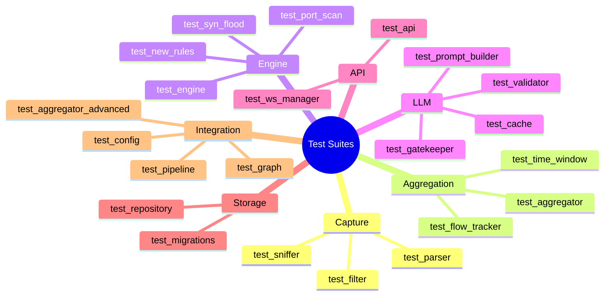

# ◆ NetWatch — AI-Assisted Real-Time Network Traffic Analyzer

<div align="center">


**A production-grade, zero-cloud network intrusion detection system with local LLM-powered threat explanation.**

[Features](#-features) · [Architecture](#-architecture) · [Installation](#-installation) · [Usage](#-usage) · [Detection Rules](#-detection-rules) · [API Reference](#-api-reference) · [Contributing](#-contributing)

</div>

---

## 👤 Author

**Prithvi** — [@prithvi-01x](https://github.com/prithvi-01x)

---

## 📖 Overview

NetWatch is a fully local, AI-augmented network traffic analyzer designed for cybersecurity students, researchers, and practitioners who want **real understanding** of what's happening on their network — not just alerts. Built from scratch in Python with a TypeScript/React dashboard, it captures raw packets, aggregates them into time windows, runs a modular rule engine to detect threats, and then uses a **local Ollama LLM** to explain each alert in plain language with actionable remediation steps.

No cloud. No subscriptions. No data leaving your machine.

NetWatch was built in **5 phases** over a 4–6 week development sprint, evolving from a basic packet sniffer into a full detection + explanation pipeline with a live web dashboard.

---

## ✨ Features

| Category | Capability |
|----------|-----------|
| **Capture** | Live packet capture via Scapy + libpcap with BPF kernel filtering |
| **Aggregation** | 3-bucket time windows (1s / 10s / 60s) with per-flow tracking |
| **Detection** | 5 modular, pluggable detection rules with confidence scoring |
| **LLM** | Local Ollama integration (phi3, mistral, etc.) with fallbacks |
| **API** | FastAPI REST + 3 WebSocket channels |
| **Frontend** | React 18 dashboard with live updates, topology map, attack graph |
| **Storage** | SQLite with auto-migration and pruning |
| **Docker** | Full Compose stack with least-privilege capture container |
| **Testing** | 22 test suites covering all major components |

---

## 🏗️ Architecture

NetWatch is structured as a **5-layer pipeline**, where data flows from raw packets to enriched, human-readable alerts via a clean async queue architecture.

### System Architecture Diagram

```mermaid
flowchart TB
    NI["🌐 Network Interface\n(eth0 / wlan0)"] --> LP
    LP["libpcap\n(BPF Filter — kernel level)"] --> SC
    SC["Scapy AsyncSniffer\n(background thread)"] --> PM

    subgraph CAPTURE["📦 CAPTURE LAYER (Phase 1)"]
        PM["PacketMeta\n(typed dataclass)"]
    end

    PM -->|asyncio.Queue| AGG

    subgraph AGGREGATION["📊 AGGREGATION LAYER (Phase 2)"]
        AGG["Aggregator"]
        FT["FlowTracker\n(5-tuple keyed)"]
        TW1["TimeWindowBucket 1s"]
        TW2["TimeWindowBucket 10s"]
        TW3["TimeWindowBucket 60s"]
        AGG --> FT
        AGG --> TW1
        AGG --> TW2
        AGG --> TW3
    end

    TW1 & TW2 & TW3 -->|AggregatedWindow| ENG

    subgraph DETECTION["🔍 DETECTION ENGINE (Phase 3)"]
        ENG["DetectionEngine"]
        PS["PortScanRule"]
        SF["SynFloodRule"]
        BF["BruteForceRule"]
        DT["DnsTunnelingRule"]
        BC["BeaconingRule"]
        ENG --> PS & SF & BF & DT & BC
    end

    ENG -->|Alert + confidence| LLM

    subgraph LLM_LAYER["🤖 LLM LAYER (Phase 5)"]
        LLM["LLMClient\n(Ollama)"]
        PB["PromptBuilder\n(sanitized)"]
        CA["ExplanationCache\n(LRU 200 entries)"]
        GK["LLMGatekeeper\n(rate limit + cooldown)"]
        VA["ResponseValidator"]
        LLM --> PB --> GK --> CA
        LLM --> VA
    end

    LLM -->|EnrichedAlert| API

    subgraph API_LAYER["🚀 API LAYER (Phase 4/5)"]
        FAPI["FastAPI\n(uvicorn)"]
        WS1["WebSocket /ws/alerts"]
        WS2["WebSocket /ws/flows"]
        WS3["WebSocket /ws/stats"]
        REST["REST Endpoints\n/api/*"]
        DB["SQLite\n(AlertRepository)"]
        FAPI --> WS1 & WS2 & WS3 & REST & DB
    end

    API_LAYER --> FE

    subgraph FRONTEND["💻 FRONTEND (React 18)"]
        DASH["Dashboard View"]
        TOPO["Topology Diagram"]
        GRAPH["Attack Graph"]
    end
```



---

### Component Interaction & Data Flow


---

### Directory Structure

```
netwatch/
├── netwatch/
│   └── backend/
│       ├── main.py                  # Entry point, task orchestration
│       ├── config.py                # Pydantic Settings (.env support)
│       ├── models.py                # PacketMeta dataclass
│       ├── pipeline.py              # Shared asyncio.Queues
│       ├── metrics.py               # Prometheus-style counters
│       ├── capture/
│       │   ├── sniffer.py           # PacketCapture (Scapy AsyncSniffer)
│       │   ├── parser.py            # Raw packet → PacketMeta
│       │   └── filter.py            # BPF filter construction
│       ├── aggregation/
│       │   ├── aggregator.py        # Main aggregation loop
│       │   ├── flow_tracker.py      # 5-tuple flow state tracking
│       │   ├── time_window.py       # 1s/10s/60s bucket logic
│       │   └── models.py            # AggregatedWindow, FlowRecord
│       ├── engine/
│       │   ├── engine.py            # DetectionEngine + rule loader
│       │   ├── models.py            # Alert, RuleResult, Severity
│       │   └── rules/
│       │       ├── base.py          # BaseRule abstract class
│       │       ├── port_scan.py
│       │       ├── syn_flood.py
│       │       ├── brute_force.py
│       │       ├── dns_tunneling.py
│       │       └── beaconing.py
│       ├── llm/
│       │   ├── client.py            # Async Ollama HTTP client
│       │   ├── prompt_builder.py    # Sanitized prompt construction
│       │   ├── cache.py             # LRU explanation cache
│       │   ├── gatekeeper.py        # Rate limiting + cooldowns
│       │   ├── validator.py         # JSON schema validation
│       │   ├── fallbacks.py         # Static fallback explanations
│       │   └── models.py            # LLMExplanation dataclass
│       ├── api/
│       │   ├── main.py              # FastAPI app factory
│       │   ├── ws_manager.py        # Multi-channel WebSocket manager
│       │   ├── serializers.py       # Pydantic response models
│       │   └── routes/
│       │       ├── alerts.py
│       │       ├── stats.py
│       │       ├── config.py
│       │       ├── docker.py
│       │       ├── llm.py
│       │       ├── graph.py
│       │       └── host_ports.py
│       ├── storage/
│       │   ├── database.py          # SQLite wrapper
│       │   ├── repository.py        # AlertRepository CRUD
│       │   └── migrations.py        # Schema versioning
│       └── tests/                   # 22 test suites
├── frontend/
│   ├── src/
│   │   ├── App.tsx                  # Root component (3 views)
│   │   ├── components/
│   │   │   ├── AlertPanel/          # Alert list + cards
│   │   │   ├── StatsBar/            # Live metrics bar
│   │   │   ├── FilterBar/           # Severity/IP/rule filters
│   │   │   ├── TrafficCharts/       # Recharts traffic visualizations
│   │   │   ├── TopologyDiagram/     # ReactFlow network topology
│   │   │   ├── AttackGraph/         # D3 attack graph visualization
│   │   │   └── shared/              # SeverityBadge, LiveIndicator, etc.
│   │   ├── hooks/                   # useAlerts, useStats, useGraph, useFlows
│   │   ├── api/                     # REST client + WebSocket manager
│   │   ├── store/                   # Zustand alert store
│   │   └── types.ts
│   └── package.json
├── docker-compose.yml
├── Dockerfile.capture
├── pyproject.toml
├── requirements.txt
└── .env                             # Your config
```

---

## 🚀 Installation

### Prerequisites

| Requirement | Version | Notes |
|-------------|---------|-------|
| Python | ≥ 3.12 | Required for `asyncio.timeout()` |
| Node.js | ≥ 18 | For frontend build |
| Docker + Compose | ≥ 24 | For containerized deployment |
| Ollama | Latest | Local LLM inference |
| libpcap / WinPcap | System | For raw packet capture |

---

### Option 1: Docker Compose (Recommended)

The fastest way to get a full stack running with all services.

**1. Clone the repository**

```bash
git clone https://github.com/prithvi-01x/netwatch.git
cd netwatch
```

**2. Configure your environment**

```bash
cp env.example .env
```

Edit `.env`:

```ini
# Your network interface (find with: ip link show or ifconfig)
CAPTURE_INTERFACE=eth0
LOCAL_NETWORK=192.168.0.0/16

# LLM settings
OLLAMA_MODEL=phi3:3.8b

# Optional: Docker socket GID for topology discovery
# Find with: stat -c %g /var/run/docker.sock
DOCKER_GID=999

LOG_LEVEL=INFO
```

**3. Pull the Ollama model**

```bash
docker run --rm ollama/ollama pull phi3:3.8b
# Or for a more powerful model:
docker run --rm ollama/ollama pull mistral
```

**4. Launch the stack**

```bash
docker compose up -d
```

Services started:
- `capture` → raw packet capture (host network, `NET_RAW` + `NET_ADMIN`)
- `backend` → FastAPI on `http://localhost:8000`
- `frontend` → React dashboard on `http://localhost:3000`
- `ollama` → LLM inference on `http://localhost:11434`

**5. Check health**

```bash
curl http://localhost:8000/health
# → {"status":"ok","ws_connections":{"alerts":0,"flows":0,"stats":0}}
```

**6. Open the dashboard**

Navigate to [http://localhost:3000](http://localhost:3000) in your browser.

---

### Option 2: Local Development

**1. Install Python dependencies**

```bash
pip install -e ".[dev]"
# or
pip install -r requirements.txt
```

**2. Install and start Ollama**

```bash
# macOS
brew install ollama
ollama serve &
ollama pull phi3:3.8b

# Linux
curl -fsSL https://ollama.ai/install.sh | sh
ollama serve &
ollama pull phi3:3.8b
```

**3. Configure `.env`**

```ini
INTERFACE=wlan0
LOCAL_NETWORK=192.168.1.0/24
OLLAMA_URL=http://localhost:11434
OLLAMA_MODEL=phi3:3.8b
LLM_ENABLED=true
DB_PATH=data/alerts.db
API_PORT=8000
LOG_LEVEL=INFO
```

**4. Run the backend**

```bash
# You may need sudo/root for raw socket access
sudo python -m netwatch.backend.main --iface wlan0 --local-net 192.168.1.0/24
```

**5. Install and start the frontend**

```bash
cd frontend
npm install
npm run dev
# → Dashboard at http://localhost:5173
```

---

### Option 3: Development Quick-Start (No LLM)

Run NetWatch without Ollama using static fallback explanations:

```bash
LLM_ENABLED=false python -m netwatch.backend.main --iface lo
```

All alerts will be issued with pre-built static explanations matching the detected rule type. This is useful for development and testing without the overhead of LLM inference.

---

## ⚙️ Configuration Reference

All settings can be set via environment variables or `.env` file. Pydantic Settings handles type coercion and validation automatically.

```ini
# ── Capture ──────────────────────────────────────────────────────────
INTERFACE=wlan0                     # Network interface to capture on
BPF_FILTER=ip                       # Berkeley Packet Filter expression
LOCAL_NETWORK=172.16.0.0/12         # Your LAN CIDR (for direction tagging)
FLOW_TTL_SECONDS=120                # How long idle flows are kept alive

# ── Detection ────────────────────────────────────────────────────────
DETECTION_CONFIDENCE_THRESHOLD=0.3  # Minimum confidence to fire an alert
ALERT_COOLDOWN_SECONDS=30           # Suppress same rule+src combo for N seconds
WHITELIST_IPS=[]                    # IPs that never trigger alerts
                                    # e.g. WHITELIST_IPS=["10.0.0.1","10.0.0.2"]

# ── Queues ───────────────────────────────────────────────────────────
CAPTURE_QUEUE_SIZE=10000            # Max buffered raw packets
DETECTION_QUEUE_SIZE=1000           # Max buffered windows
ALERT_QUEUE_SIZE=500                # Max unprocessed alerts
ENRICHED_QUEUE_SIZE=500             # Max enriched alerts awaiting broadcast

# ── Storage ──────────────────────────────────────────────────────────
DB_PATH=data/alerts.db              # SQLite database location
STATS_SNAPSHOT_MAX_ROWS=2000        # Max stats rows before pruning

# ── API ──────────────────────────────────────────────────────────────
API_HOST=0.0.0.0
API_PORT=8000

# ── LLM / Ollama ─────────────────────────────────────────────────────
OLLAMA_URL=http://localhost:11434
OLLAMA_MODEL=phi3:3.8b              # or: mistral, llama3, gemma2 etc.
LLM_ENABLED=true
LLM_MIN_CONFIDENCE=0.5              # Only call LLM for alerts above this threshold
LLM_MAX_CALLS_PER_MINUTE=10        # Rate limit for Ollama calls
LLM_COOLDOWN_SECONDS=30             # Per-rule+src cooldown for LLM calls

# ── Logging ──────────────────────────────────────────────────────────
LOG_LEVEL=INFO                      # DEBUG | INFO | WARNING | ERROR
```

---

## 🔍 Detection Rules

NetWatch ships with **5 detection rules** out of the box. The engine uses a plugin architecture — adding a new rule is as simple as creating a new Python file in `engine/rules/` and subclassing `BaseRule`.

### Detection Engine Overview

```mermaid
flowchart LR
    AW["AggregatedWindow"] --> DE

    subgraph DE["DetectionEngine"]
        direction TB
        CK["⚡ Confidence\nThreshold Check"]
        WL["🛡️ IP Whitelist\nCheck"]
        CD["⏱️ Cooldown\nCheck"]
        CK --> WL --> CD
    end

    DE --> |Alert| DB["💾 SQLite"]
    DE --> |Alert| LLM["🤖 LLM Enrichment"]
    DE --> |Suppressed| STATS["📊 Suppression Stats"]

    subgraph RULES["Rule Modules"]
        R1["PortScanRule\n🔴 HIGH"]
        R2["SynFloodRule\n🔴 CRITICAL"]
        R3["BruteForceRule\n🔴 HIGH"]
        R4["DnsTunnelingRule\n🟡 HIGH"]
        R5["BeaconingRule\n🔴 CRITICAL"]
    end

    RULES --> AW
```



---

### Rule 1: Port Scan Detection

**File:** `engine/rules/port_scan.py`  
**Severity:** HIGH → CRITICAL (confidence-scaled)  
**Strategy:** Detects a single source IP contacting an unusually high number of distinct destination ports within a time window.

| Window | Threshold (unique ports) |
|--------|--------------------------|
| 1s     | 15 ports                 |
| 10s    | 30 ports                 |
| 60s    | 50 ports                 |

**Confidence formula:**
```
confidence = min(1.0, unique_ports / (threshold × 3))
```

**Evidence fields:**
- `src_ip` — the scanning host
- `unique_ports_contacted` — total distinct ports hit
- `sampled_ports` — up to 10 example ports (sorted)
- `threshold` — active threshold for this window size

---

### Rule 2: SYN Flood Detection

**File:** `engine/rules/syn_flood.py`  
**Severity:** CRITICAL  
**Strategy:** Finds TCP flows with `SYN` in flags but no `SYN-ACK`, above a packets-per-second rate threshold. Characteristic of DoS attacks or aggressive half-open scanners.

| Window | Min SYN packets |
|--------|----------------|
| 1s     | 100            |
| 10s+   | 500            |

**Confidence formula:**
```
confidence = min(1.0,
    (total_syn_packets / threshold) × 0.6 +
    (syn_only_flows / total_tcp_flows) × 0.4
)
```

The blend of raw volume (60%) and SYN ratio (40%) prevents false positives from legitimate high-traffic servers while still catching floods.

**Evidence fields:**
- `src_ips` — all sources contributing to the flood
- `total_syn_packets` — aggregate SYN packet count
- `peak_syn_rate` — highest observed SYN rate (pkt/s)
- `target_ips` — up to 5 targeted hosts

---

### Rule 3: Brute Force Detection

**File:** `engine/rules/brute_force.py`  
**Severity:** HIGH  
**Strategy:** Identifies flows targeting authentication ports (SSH, FTP, Telnet, RDP, VNC) with high packet rate, small average payload, and sufficient attempt count.

**Auth ports monitored:** `22 (SSH), 21 (FTP), 23 (Telnet), 3389 (RDP), 5900 (VNC)`

| Threshold | Value |
|-----------|-------|
| Min attempts/sec | 5.0 |
| Min total attempts | 20 |
| Max auth payload size | 256 bytes |

The low payload size filter (`≤ 256 bytes`) distinguishes credential stuffing from legitimate data transfer on the same ports.

---

### Rule 4: DNS Tunneling Detection

**File:** `engine/rules/dns_tunneling.py`  
**Severity:** HIGH  
**Strategy:** Detects data exfiltration through DNS by looking for unusually high query counts or oversized DNS payloads from a single host.

| Trigger | Threshold |
|---------|-----------|
| Queries per 10s | > 200 |
| Avg DNS payload | > 150 bytes |

DNS payloads above 150 bytes are suspicious because legitimate DNS queries are typically 20–60 bytes. Subdomains encoding base64 data inflate this significantly.

---

### Rule 5: C2 Beaconing Detection

**File:** `engine/rules/beaconing.py`  
**Severity:** CRITICAL  
**Strategy:** Detects Command & Control beaconing — malware periodically checking in with a C2 server. Looks for flows with:
- Long duration (≥ 45 seconds)
- Low, steady packet rate (0.1–2.0 pkt/s) — the "heartbeat" pattern
- Small average payload (≤ 128 bytes)
- Connecting to non-standard ports (excludes 80, 443, 53, 22, 25, 587)

The combination of these signals separates C2 beaconing from legitimate long-lived connections.

---

### Writing a Custom Rule

```python
# netwatch/backend/engine/rules/my_custom_rule.py

from ...aggregation.models import AggregatedWindow
from ..models import RuleResult, Severity
from .base import BaseRule

class MyCustomRule(BaseRule):
    name = "my_custom_rule"
    severity = Severity.HIGH
    enabled = True

    # Your thresholds
    some_threshold: int = 100

    def analyze(self, window: AggregatedWindow) -> RuleResult:
        # Examine window.top_flows, window.total_packets,
        # window.unique_src_ips, window.unique_dst_ports, etc.

        triggered = False  # Your detection logic here

        if not triggered:
            return RuleResult(
                triggered=False,
                confidence=0.0,
                evidence={},
                description="no anomaly detected",
            )

        return RuleResult(
            triggered=True,
            confidence=0.85,
            evidence={"src_ip": "1.2.3.4", "detail": "..."},
            description="Anomaly detected from 1.2.3.4",
        )
```

Drop it into `engine/rules/` — the engine discovers and loads all `BaseRule` subclasses automatically via `pkgutil.iter_modules`.

---

## 🤖 LLM Integration

NetWatch integrates with **Ollama** for fully local, privacy-preserving LLM enrichment. When an alert fires, the LLM layer enriches it with:

- A plain-English `summary` of the attack
- An assessed `attack_phase` (reconnaissance, lateral_movement, exfiltration, etc.)
- A `recommended_action` for the analyst
- An `llm_confidence` score (CONFIDENT / UNCERTAIN)
- Relevant `ioc_tags`


### Security: Prompt Injection Prevention

The `PromptBuilder` applies strict sanitization before any alert data reaches the LLM:

1. **Evidence key whitelist** — Only pre-approved statistical fields are included. Raw payloads, user strings, and hostnames never reach the model.
2. **Injection pattern stripping** — Regex matches and neutralizes patterns like `ignore previous instructions`, `you are now`, `[INST]`, `<system>`, etc.
3. **String truncation** — All string values are capped at 120 characters and stripped of control characters.
4. **JSON-only output enforcement** — The system prompt mandates strict JSON with no preamble. The validator rejects anything that doesn't conform.

### Supported Ollama Models

| Model | Size | Speed | Quality | Recommended For |
|-------|------|-------|---------|----------------|
| `phi3:3.8b` | 2.3 GB | ⚡ Fast | Good | Default, resource-limited systems |
| `mistral:7b` | 4.1 GB | Medium | Better | Desktop workstations |
| `llama3:8b` | 4.7 GB | Medium | Better | High-quality explanations |
| `gemma2:9b` | 5.4 GB | Slower | Best | Security-focused analysis |

Switch models by setting `OLLAMA_MODEL=mistral` in your `.env`.

### LLM Fallback Behavior

If Ollama is unreachable, busy, times out, or returns invalid JSON, NetWatch **always** falls back to a static, rule-specific explanation. Alerts are never dropped or delayed due to LLM failure. The fallback system provides meaningful (if less detailed) explanations for all 5 rule types.

---

## 📡 API Reference

### REST Endpoints

| Method | Path | Description |
|--------|------|-------------|
| `GET` | `/health` | Health check + WebSocket connection counts |
| `GET` | `/api/alerts` | Paginated alert history |
| `GET` | `/api/alerts/{id}` | Single alert by ID |
| `GET` | `/api/stats` | Pipeline statistics snapshot |
| `GET` | `/api/stats/history` | Historical stats snapshots |
| `GET` | `/api/config` | Current runtime configuration |
| `PATCH` | `/api/config` | Update runtime configuration |
| `GET` | `/api/docker/containers` | Discovered Docker containers |
| `GET` | `/api/host/ports` | Open ports on host |
| `GET` | `/api/graph` | Attack graph data (nodes + edges) |
| `GET` | `/api/llm/status` | LLM client status + stats |
| `POST` | `/api/llm/explain` | On-demand LLM explanation |

### WebSocket Channels

| Channel | Path | Payload | Push Rate |
|---------|------|---------|-----------|
| Alerts | `/ws/alerts` | `EnrichedAlert` JSON | On detection |
| Flows | `/ws/flows` | Top-10 flows by bytes | Every 1s |
| Stats | `/ws/stats` | Pipeline metrics snapshot | Every 5s |

### Example: Fetch Recent Alerts

```bash
curl "http://localhost:8000/api/alerts?limit=20&severity=HIGH&offset=0"
```

```json
{
  "alerts": [
    {
      "alert_id": "3f8c21a0-...",
      "timestamp": 1709123456.78,
      "rule_name": "port_scan",
      "severity": "HIGH",
      "confidence": 0.84,
      "src_ip": "192.168.1.55",
      "dst_ip": "multiple",
      "description": "192.168.1.55 contacted 38 unique ports in 10s window",
      "evidence": {
        "unique_ports_contacted": 38,
        "sampled_ports": [21, 22, 80, 443, 3306, 5432, 6379, 8080, 8443, 9200]
      },
      "llm_explanation": {
        "summary": "A port scan was detected from 192.168.1.55...",
        "attack_phase": "reconnaissance",
        "recommended_action": "Block the source IP at the firewall...",
        "llm_confidence": "CONFIDENT",
        "ioc_tags": ["port_scan", "recon"]
      }
    }
  ],
  "total": 142
}
```

### Example: WebSocket Flow Consumer (JavaScript)

```javascript
const ws = new WebSocket('ws://localhost:8000/ws/flows');

ws.onmessage = (event) => {
    const { flows, timestamp } = JSON.parse(event.data);
    flows.forEach(flow => {
        console.log(`${flow.src_ip}:${flow.src_port} → ${flow.dst_ip}:${flow.dst_port} | ${flow.pps} pkt/s`);
    });
};
```

---

## 💻 Frontend Dashboard

The React dashboard provides three views accessible via the top navigation bar.

### View 1: Dashboard

The primary monitoring view with:

- **StatsBar** — Live metrics across the top: packets seen, packets dropped, active flows, alerts fired, windows analyzed
- **FilterBar** — Filter alerts by severity (CRITICAL / HIGH / MEDIUM / LOW), source IP, or rule name
- **AlertPanel** — Virtualized, paginated alert list (react-window) with per-alert LLM explanation expansion
- **TrafficCharts** — Recharts visualizations showing packet rate, protocol distribution, and alert frequency over time

### View 2: Network Topology

Built with **ReactFlow**, this view auto-discovers and renders your network:

- **ISP node** — upstream internet connection
- **Router node** — detected gateway
- **Host nodes** — local hosts with open ports displayed as badges
- **Docker nodes** — running containers with exposed port labels

Topology data is fetched from `/api/docker/containers` and `/api/host/ports` on load.

### View 3: Attack Graph

D3-powered graph visualization showing attack relationships:

- Nodes represent hosts (colored by role: local/external/scanner)
- Edges represent observed attack flows
- Node size scales with alert count
- Clicking a node opens a detail panel with IP, alert history, and a "filter dashboard by this IP" action

---

## 🧪 Testing

NetWatch has **22 test suites** covering all major components.

```bash
# Run all tests
pytest

# With coverage
pytest --cov=netwatch --cov-report=html

# Run a specific suite
pytest netwatch/backend/tests/test_engine.py -v

# Run with live logging
pytest --log-cli-level=DEBUG
```

### Test Suite Overview



### Testing Without Root (Capture Layer)

The capture layer requires `libpcap` access (root). Tests mock Scapy's `AsyncSniffer` to run without elevated privileges:

```python
# All sniffer tests use:
@patch("netwatch.backend.capture.sniffer.AsyncSniffer")
def test_capture_starts(mock_sniffer, ...):
    ...
```

---

## 🐳 Docker Architecture


### Security Design of the Capture Container

The capture container is designed with least-privilege principles:

```yaml
cap_add:
  - NET_RAW    # Required for libpcap raw sockets
  - NET_ADMIN  # Required for interface configuration
cap_drop:
  - ALL        # Drop all other Linux capabilities
read_only: true              # Immutable filesystem
tmpfs:
  - /tmp:size=64m            # Only /tmp is writable
security_opt:
  - no-new-privileges:true   # Prevent privilege escalation
network_mode: host           # Required for libpcap
```

---

## 🔄 Pipeline Internals

### Queue Architecture


All queues use `safe_put()` — a wrapper that drops the item and logs a warning rather than blocking if a queue is full. This ensures the capture pipeline is never stalled by a slow downstream consumer.

### Time Window Architecture

Each packet feeds into three independent `TimeWindowBucket` instances simultaneously:

```
Packet arrives at t=15.7s
  → 1s  bucket: [15s, 16s) — almost full, emits at t=16.0
  → 10s bucket: [10s, 20s) — accumulating
  → 60s bucket: [00s, 60s) — accumulating

Emit at t=16.0:
  → 1s  window emitted: AggregatedWindow(window_size_seconds=1, ...)
  → Rules run against 1s window

Emit at t=20.0:
  → 10s window emitted: AggregatedWindow(window_size_seconds=10, ...)
  → Rules run against 10s window (different thresholds)
```

Shorter windows catch fast attacks (SYN floods). Longer windows catch slow, stealthy attacks (port scans spread over time, beaconing).

### Alert Lifecycle


---

## 📊 Metrics & Observability

NetWatch exposes runtime metrics through the `/api/stats` endpoint and the `/ws/stats` WebSocket channel. These are also logged every 5 seconds at `INFO` level.

```json
{
  "timestamp": 1709123500.0,
  "packets_seen": 142850,
  "packets_dropped": 0,
  "flows_active": 23,
  "alerts_fired": 7,
  "windows_analyzed": 1840
}
```

Internal counters tracked across the pipeline:

| Counter | Location | Description |
|---------|----------|-------------|
| `packets_received` | `METRICS` | Raw packets from libpcap |
| `packets_parsed_ok` | `METRICS` | Successfully parsed to PacketMeta |
| `packets_parse_error` | `METRICS` | Failed parsing (logged, not dropped) |
| `packets_non_ip` | `METRICS` | ARP, etc. — silently skipped |
| `windows_analyzed` | engine.stats | AggregatedWindows processed |
| `alerts_fired` | engine.stats | Alerts passing all checks |
| `alerts_suppressed` | engine.stats | Below confidence threshold |
| `alerts_cooldown` | engine.stats | Suppressed by cooldown |
| `alerts_whitelisted` | engine.stats | Suppressed by whitelist |
| `calls_made` | llm.stats | Total Ollama API calls |
| `cache_hits` | llm.stats | LRU cache hits |
| `fallbacks_used` | llm.stats | Times fallback was used |
| `timeouts` | llm.stats | Ollama calls that timed out |

---

## 🔐 Security Notes

### Running with Minimal Privileges

Raw packet capture inherently requires elevated access. NetWatch minimizes this surface:

**Native (Linux):**
```bash
# Grant capability to Python binary instead of running as root
sudo setcap cap_net_raw,cap_net_admin+eip $(which python3)
python3 -m netwatch.backend.main --iface eth0
```

**Docker:** The capture container drops all capabilities and only keeps `NET_RAW` + `NET_ADMIN`. The backend and frontend containers run with no special privileges.

### What Data Is Stored

NetWatch stores only metadata — **no packet payloads**:

- IP addresses (src/dst)
- Port numbers
- Packet counts and byte counts
- Derived statistics (rates, ratios)
- LLM-generated explanations (text)

Raw packet data never persists to disk, and raw payload content never reaches the LLM.

### Network Exposure

The API (`port 8000`) and dashboard (`port 3000`) should **not** be exposed to untrusted networks. They are designed for local/LAN access only. There is no authentication layer — add a reverse proxy with auth (Nginx + basic auth, or Tailscale) if remote access is needed.

---

## 🛠️ Troubleshooting

### No packets being captured

```bash
# Check interface name
ip link show
# or
ifconfig -a

# Check libpcap is installed
python -c "from scapy.all import AsyncSniffer; print('OK')"

# Verify BPF filter is valid
tcpdump -i eth0 ip -c 5
```

### Ollama not connecting

```bash
# Check Ollama is running
curl http://localhost:11434/api/tags

# Check model is available
ollama list

# Pull the model if missing
ollama pull phi3:3.8b
```

### Alerts not appearing in dashboard

```bash
# Check WebSocket connection in browser DevTools → Network → WS
# Check health endpoint
curl http://localhost:8000/health

# Check backend logs
docker compose logs backend -f
```

### High packet drop rate

Increase queue sizes in `.env`:
```ini
CAPTURE_QUEUE_SIZE=50000
```

Or reduce capture scope with a tighter BPF filter:
```ini
BPF_FILTER=tcp and not port 22
```

---

## 🗺️ Development Roadmap


### Planned Features

- **PCAP replay** — Run NetWatch against saved `.pcap` files for offline analysis and testing
- **STIX 2.1 export** — Export alerts in STIX format for SIEM ingestion
- **GeoIP enrichment** — Tag external IPs with country + ASN using MaxMind GeoLite2
- **Prometheus endpoint** — `/metrics` for Grafana dashboards
- **Basic auth** — Simple token-based auth for the API
- **Alert deduplication** — Graph-aware deduplication for distributed alerts
- **Mobile-responsive UI** — Tailwind-based responsive redesign

---

## 🤝 Contributing

Contributions are welcome! The most impactful areas:

1. **New detection rules** — Add rules in `engine/rules/`. See the Writing a Custom Rule section above.
2. **Frontend improvements** — React components, better visualizations, dark/light theme.
3. **Tests** — Especially integration tests and edge cases.
4. **Documentation** — Examples, guides, blog posts.

### Development Setup

```bash
git clone https://github.com/prithvi-01x/netwatch.git
cd netwatch

# Python
pip install -e ".[dev]"

# Frontend
cd frontend && npm install && npm run dev

# Run tests
pytest --cov=netwatch
```

### Code Style

- Python: `ruff` for linting, `black` for formatting
- TypeScript: Prettier with project defaults
- All new rules must have corresponding test files in `tests/`

---

## 📁 Data Model Reference

### PacketMeta

```python
@dataclass
class PacketMeta:
    timestamp: float          # Unix timestamp
    src_ip: str               # Source IP address
    dst_ip: str               # Destination IP address
    src_port: int             # Source port (0 for ICMP)
    dst_port: int             # Destination port
    protocol: str             # "TCP" | "UDP" | "ICMP"
    length: int               # Packet length in bytes
    payload_size: int         # Application layer payload size
    flags: str | None         # TCP flags string (e.g. "SYN", "SYN-ACK")
    direction: str            # "inbound" | "outbound" | "internal"
```

### AggregatedWindow

```python
@dataclass
class AggregatedWindow:
    window_start: float
    window_end: float
    window_size_seconds: int       # 1, 10, or 60
    total_packets: int
    total_bytes: int
    unique_src_ips: set[str]
    unique_dst_ports: set[int]
    protocol_counts: dict[str, int]
    top_flows: list[FlowRecord]    # Top 10 flows by packet count
```

### Alert

```python
@dataclass
class Alert:
    alert_id: str              # UUID4
    timestamp: float
    rule_name: str
    severity: Severity         # CRITICAL | HIGH | MEDIUM | LOW
    confidence: float          # 0.0 – 1.0
    src_ip: str
    dst_ip: str
    description: str
    evidence: dict             # Rule-specific evidence fields
    window_start: float
    window_end: float
    window_size_seconds: int
```

### LLMExplanation

```python
@dataclass
class LLMExplanation:
    summary: str               # Plain English attack description
    attack_phase: str          # reconnaissance | initial_access | ...
    recommended_action: str    # Analyst guidance
    llm_confidence: str        # "CONFIDENT" | "UNCERTAIN"
    ioc_tags: list[str]        # ["port_scan", "recon", ...]
    fallback_used: bool        # True if LLM was unavailable
```

---

## 📜 License

MIT License — see [LICENSE](LICENSE) for details.

---

## 🙏 Acknowledgments

- [Scapy](https://scapy.net/) — Python packet manipulation library
- [FastAPI](https://fastapi.tiangolo.com/) — Modern async Python web framework
- [Ollama](https://ollama.ai/) — Local LLM inference runtime
- [ReactFlow](https://reactflow.dev/) — Node-based graph UI for topology visualization
- [Recharts](https://recharts.org/) — React charting library
- [Zustand](https://zustand-demo.pmnd.rs/) — Lightweight React state management

---

<div align="center">

**Built with ⚡ and obsessive attention to async correctness**

[⬆ Back to top](#-netwatch--ai-assisted-real-time-network-traffic-analyzer)

</div>
